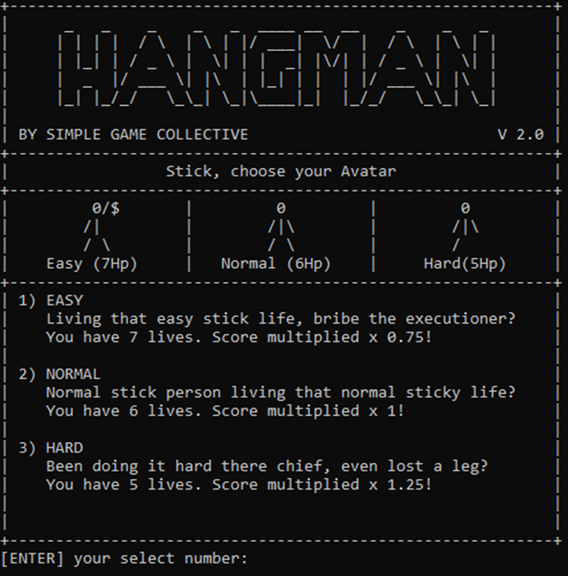
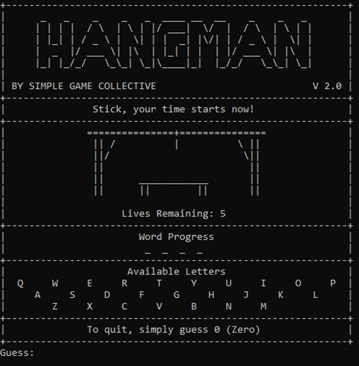
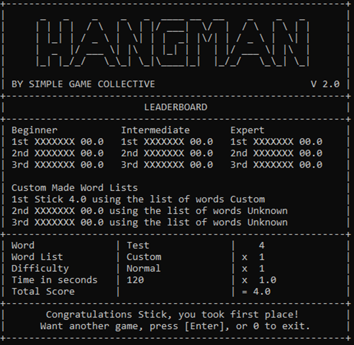

# **HANGMAN**

User Manual  
Version 2.0

Emmette Taylor | Apply Introductory Programming Techniques | Semester 1, 2022

### Purpose

This document is intended to provide users with all the required information to install, play and troubleshoot problems
with the release of Hangman, Version 2.0 by Simple Game Collective. This version was released on the 4th of May 2022.
Any errors or mistakes found within this documentation or game may be sent to the author of this document, Emmette
Taylor at Simple Game Collective.

### System Requirements

This program should work on all modern operating systems.  
To run the game, it is a requirement to have the Python 3 interpreter installed on your computer. It can be downloaded
from following website:  
https://www.python.org/downloads/   
Simply choose the latest version for your operating system and follow the prompts.  
You will also need the game files. Download the game and place it in a folder you can access from the command prompt
interface.

### Custom Word Lists

In the game, you have the option to select from a word list that you upload.  
Create a text file and write one word per line, with no punctuation and place it in the 'custom_word_lists' folder. Your
custom word list will now appear under the custom word list choices the next time the game is launched.

### Object of the Game

The object of the game is to guess the word before you run out of lives.  
You will guess a single character at a time and if the letter is in the word, it will appear, if not, you lose a life.

### Starting the Game

Search your computer for command prompt and open it.  
Use the directory to open the folder where you have stored the game.  
If you want to know what folders you can choose from, use the command: dir  
If you want to select folder from the current directory, use the command: cd folder name  
If you make a mistake at any point and need to go back, use the command: cd ..  
Once the folder is located and entered, use this command to start the game: python main.py

### Next Guess Assistance  
If you would ever like help with your next guess, in a separate terminal window for the same file, run the command: python next_letter_probability.py  
You will be prompted to enter your progress so far, that is T--T, and all the letters you have guessed.  
It will return the probability of each remaining letter that may be in the word.

## **Playing the Game**

### Introduction

When the game is started, the following screen will appear:

  
Here you will be able to see the current high score holder, their scores and which list of words they used to achieve
it.

#### Choose a name that adheres to the following:

1. Your name must be at least one character long, so we have something to display.
2. Your name must be no more than seven characters long, as that will cause spacing issues.
3. Your name must not contain any spaces.

This name will be used throughout the game and will appear on the leader board if you achieve a high score.   
Once chosen, type then name and press the enter key.

Once you have entered your name, the following screen will appear:

  
These are the general rules for the game and should be enough to get a user started straight away.  
If a more detailed explanation is required, or if the user would like more in-depth knowledge of the workings and
scoring of the game, they can continue to read the user manual.  
Once the rules have been read, press the enter key to continue.

### Word Selection

The following screens will relate to choosing the collection of words from which a random word will be selected for you.

The following screen will appear:

  
Select 1, 2, 3 or 4 depending on which word list collection you would like to play.  
Note that these collections will be filtered so that only words with four or more letters will be used within the game,
and custom lists containing zero words won’t be accepted.

**Beginner**  
These are the most common 500 words in the English language.  
As these words should be known to you, the score of the word will be multiplied by 0.75 to calculate your final score.

**Intermediate**  
These are the most common 5000 words in the English language.  
As these words should also be known to you but a little harder, the score of the word will be multiplied by 1.00 to
calculate your final score.

**Expert**  
These are all the words in the English language, approximately 370100.  
As these words could be absolutely anything, the score of the word will be multiplied by 1.25 to calculate your final
score.

**Custom**  
If you have uploaded a custom word collection, select this.  
Custom word collections will be multiplied by 1.00 to calculate your final score.

If 4 was entered to select from a custom list, the following screen will appear:

  
Select the number that appears next to the list you would like to use.  
If you have uploaded a custom list into the folder after the game was started, you will need to restart the program. If
you no longer wish to select a custom list, you can type 0 (Zero), and press enter to return to the original word
selection page.

### Difficulty Selection

The following screen will relate to how many incorrect guesses you will be able to make during the game.  
The following screen will appear:

  
Select 1, 2 or 3 to choose a difficulty level, and therefor the number of chances you will have.

**Easy**  
You will have an extra chance to discover the word, seven in total.  
The score of the word will be multiplied by 0.75 to calculate your final score.

**Normal**  
You will have the normal number of chances, six in total.  
The score of the word will be multiplied by 1.00 to calculate your final score.

**Hard**  
You will one less chance to discover the word, five in total.  
The score of the word will be multiplied by 1.25 to calculate your final score.

### Gameplay

The following screens will relate to the guessing of the hidden word.  
The following screen will appear:

  
Once this screen appears, you will be timed to see how long it takes you to solve the puzzle. This will affect your
final score and will be detailed in scoring.

**Areas to note:** 	
The area which shows your remaining lives. This is how many incorrect guesses you have until the game will end in a
loss.  
The area which shows the word progress. Each ‘_’ relates to a single letter, showing the length of the word.  
The area which shows the available letters. These are the letters you have not guesses yet and therefore can still be
chosen.  
You can exit the game at any point by typing 0 (Zero) and pressing the enter key.

You must now guess a single letter from the available letters.

**Correct Guess**  
If your guess was correct, the following screen will appear:

  
The picture will remain the same.  
The lives remaining will remain the same.  
Letters will appear in the word progress to show their place.  
The letter you guessed will no longer appear in available letters.

**Incorrect Guess**  
If your guess was incorrect, the following screen will appear:

  
A body part from your avatar will appear in the picture.  
Your remaining lives will reduce by one.  
There will be no change to your word progress.  
The letter you guessed will no longer appear in available letters.

**Invalid Guess**  
If you enter something that is neither a correct nor incorrect guess, a screen like the following will appear:

  
The picture will remain the same.  
The lives remaining will remain the same.  
There will be no change to your word progress.  
There will be no change to the available letter.  
There will be a message explaining wey the guess was invalid. Possible causes of this may include no character entered,
not a letter, more than one character entered, or you already guessed that letter.

### Play-through

Continue playing until one of the following occurs:

1. You discover what the secret word was.
2. You no longer have any lives remaining.
3. You quit.

### Scoring

Once the game is complete, the following screen will appear:

  
Scores will be calculated and shown no matter what the result of the game was.  
Only if the game is won though will the user replace a lower score on the leader board.

The Following will affect your score:

**Word**  
Each letter in the world is assigned a numerical value below. These are added together to get the word score.

| A   | B   | C   | D   | E   | F   | G   | H   | I   | J   | K   | L   | M   | N   | O   | P   | Q   | R   | S   | T   | U   | V   | W   | X   | Y   | Z   |
|-----|-----|-----|-----|-----|-----|-----|-----|-----|-----|-----|-----|-----|-----|-----|-----|-----|-----|-----|-----|-----|-----|-----|-----|-----|-----|
| 1   | 3   | 3   | 2   | 1   | 4   | 2   | 4   | 1   | 8   | 5   | 1   | 3   | 1   | 1   | 3   | 10  | 1   | 1   | 1   | 1   | 4   | 4   | 8   | 4   | 10  |

**Word lists**  
As word list contain more difficult words, your score from the letters will be multiplied by one of the following
values.  
For the beginner level list, a 0.75 multiplier will apply.  
For the intermediate level list, a 1.00 multiplier will apply.  
For any custom lists, 1.00 multiplier will apply.  
For the expert level list, a 1.25 multiplier will apply.

**Difficulty**  
As the number of lives vary, your score from the letters will be multiplied by one of the following values.  
For the easy difficulty, a 0.75 multiplier will apply.  
For the normal difficulty, a 1.00 multiplier will apply.  
For the hard difficulty, a 1.25 multiplier will apply.

Once both multipliers are considered, a high variety of multipliers can be achieved.

|                 | Beginner (.75) | Intermediate / Custom (1) | Expert (1.25) |
|-----------------|:--------------:|:-------------------------:|:-------------:|
| **Easy (.75)**  |      .56       |            .75            |      .94      |
| **Normal (1)**  |      .75       |             1             |      1.2      |
| **Hard (1.25)** |      .94       |            1.2            |     1.56      |

**Time Multiplier**  
The multiplier for time is calculated as follows: 1 / (time / 120)  

| Time (Seconds) |   20   |   40   |  60   |   80    |   100   |  120  |   140    |   160    |   180    |
|----------------|:------:|:------:|:-----:|:-------:|:-------:|:-----:|:--------:|:--------:|:--------:|
| **Multiplier** | **6**  | **3**  | **2** | **1.5** | **1.2** | **1** | **0.86** | **0.75** | **0.67** |

**Total Score**  
Total score = word score * word list multiplier * difficulty multiplier * time multiplier

*You then have the option to play again or exit the game.*
